<!-- AUTO-GENERATED SECTION: do not hand-edit between profile markers. -->
<div align="center">

<picture>
  <source media="(prefers-color-scheme: dark)" srcset="./assets/hero/hero-dark.svg">
  <source media="(prefers-color-scheme: light)" srcset="./assets/hero/hero-light.svg">
  
</picture>

</div>

---

## `~/about`

I am a **software engineer** with a systems-oriented focus on backend engineering, distributed systems, and reliability. I enjoy building services where correctness, failure handling, performance, and clean abstractions matter.

B.Tech, Civil Engineering — IIT Jammu (2026) · **CGPA 8.37**

## `~/experience`

### GSPANN Technologies, Inc.
**Software Engineer Trainee — SRE Focus** · Jun 2026 – Present · On-site

  - Enterprise SRE and IT operations training
  - ITIL incident, service-request, and infrastructure-change lifecycle
  - Application and infrastructure monitoring concepts
  - L1/L2/L3 escalation, SLA, FCR, and MTTR frameworks
### VouchIt
**Software Development Engineer Intern** · Jun 2025 – Aug 2025 · Remote

  - Built PDF extraction logic using pdfplumber
  - Implemented parsing rules for 8 bank statement formats
  - Handled heterogeneous layouts with robust extraction rules
### RecurX
**Frontend Developer Intern** · May 2025 – Jun 2025 · Remote

  - Improved website UI with Next.js
  - Reduced bounce rate by 15%
  - Built responsive reusable components with Tailwind CSS and shadcn/ui

## `~/projects`

<details open>
<summary><strong>Real-time Trading Platform</strong> — Mock Exchange with Binance Integration</summary>

Event-driven microservices trading platform with live market data and order execution. — [source](https://github.com/Ekagra444/TradingPlatform)

**Stack:** `Next.js · TypeScript · Node.js · PostgreSQL · Redis · Binance WebSocket API`

  - Market and limit order matching using a min/max heap order book
  - API Gateway, Execution Service, and Event Service architecture
  - Redis Pub/Sub for service communication and WebSocket market streams
  - JWT authentication with HttpOnly cookies and balance reservation
  - Persistent candlestick charts and command/event tables

</details>

<details open>
<summary><strong>Job Platform Review Backend</strong> — Production-oriented Node.js backend</summary>

Layered backend for a job-review platform with security, validation, persistence, and real-world API concerns.

**Stack:** `Node.js · Express · TypeScript · PostgreSQL · Socket.IO · Redis · Zod`

  - Routes → Controllers → Services → Repositories → Database architecture
  - PostgreSQL indexing, connection pooling, and pagination
  - JWT + HttpOnly cookies, Helmet, CORS, and rate limiting
  - Centralized error handling and structured logging with Winston

</details>

<details open>
<summary><strong>Second Brain</strong> — Personal Knowledge Management System</summary>

Full-stack platform for structured knowledge capture, organization, and retrieval.

**Stack:** `React · TypeScript · Tailwind CSS · Zustand · React Query · Node.js · Express · MongoDB`

  - Responsive knowledge-capture and search workflow
  - JWT-secured Node.js + Express backend
  - Efficient client state and server-cache handling with Zustand and React Query

</details>

## `~/stack`

| Area | Technologies |
|---|---|
| Languages | C · C++ · JavaScript · TypeScript · Python |
| Backend | Node.js · Express.js · REST APIs · JWT |
| Frontend | React · Next.js · Tailwind CSS · shadcn/ui |
| Data | PostgreSQL · MongoDB · MySQL · Prisma |
| Systems | Redis · WebSockets · Pub/Sub · Rate Limiting |
| Tooling | Git · Zod · Winston · Vite · Lightweight Charts |

## `~/problem-solving`

- 900+ coding problems solved
- Codeforces Specialist — max rating 1440
- CodeChef Global Rank 193 — Starters 207 (Oct 2025)

## `~/connect`

[GitHub](https://github.com/Ekagra444) · [Email](mailto:ekagra444@gmail.com)

```text
$ echo "build reliable systems, then make them easy to understand"
build reliable systems, then make them easy to understand
```

<!-- END AUTO-GENERATED SECTION -->
